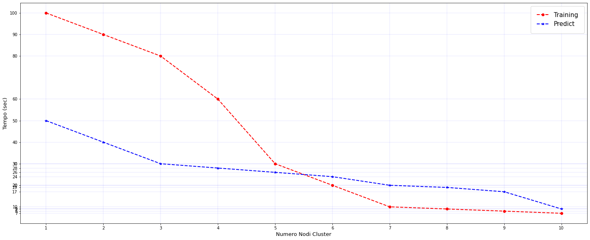

# Spark_Tensorflow

Distribute tensorflow training and predictions through spark cluster

This source code is useful for working with tensorflow in a distributed mode using Apache Spark.

We used these packages: \
Spark 3.0.1\
Hadoop 2.7.7 or more recent versions\
numpy 1.18.5\
tensorflow 2.3.0\
pyspark 3.0.1\
pandas 1.1.5\
spark_tensorflow_distributor 0.1.0\
matplotlib 3.3.3

### In order to install project requirements (listed above)
```
pip3 install -r requirements.txt
```

### Note
We assume that you already have configured your spark and hadoop environments. If you did not, configure them before proceeding.

---

### Project description

This project has been developed using the MNIST dataset, since it is the most known one and is already included in tensorflow package.
You will need to modify both *distributed_training.py* and *distributed_prediction_and_test.py* in order to make them working with your own spark and hadoop environment.

---
#### distributed_training.py

In this file, we acquire the MNIST train set. Then, we preprocess it in order to make it distributable on cluster nodes.\
Then, each node will create his own model and all the training steps are performed in synchronized mode on the entire cluster, using ALL AVAILABLE CPU CORES.
Then, the trained model will be saved on the driver node.

---

#### distributed_prediction_and_test.py

In this file, we acquire the MNIST test set. Then, we distribute a .parquet file into HDFS in order to make it available to all nodes.
Them, the framework will compute all the predictions and the resulting accuracy score.

---
#### Spark_Tensorflow_distributed_Plot.ipynb

In this file, simply we create a plot in order to represent differences in training and prediction times with different number of nodes.


###### Example


---
## Steps to run distribute training and predictions

#### 1 AWS istances configuration by Terraform
You can follow the instruction in the readme at this link: https://github.com/DanyOrtu97/Spark-Terraform-.git in order to configure the Spark cluster on Amazon AWS

#### 2 Connection to the master istance on AWS by amzkey.pem
Open a terminal on the Terraform directory where there is the key file and type:
```
ssh -i amzkey.pem /home/ubuntu/[adsress of master istance]
```
Yuo can find the master' address on the AWS console in the istance informations

#### 3 Run Spark and Hadoop on the master
In the same terminal where you connecting to the master istance, you need to type this command in order to starting Spark and Hadoop:
```
sh spark-start-master.sh
```

```
sh hadoop-start-master.sh
```

#### 4 Connection to slaves istances
Now one by one you must connect with the slaves using the command:
```
shh [name slave]  //Example ssh s02
```

#### 5 Run the slave istances
On each slave istance you can run this command in order to active the istance for the computation:
```
sh spark-start-slave.sh
```

#### 6 Change the Java environment on distribute_training.py
```
os.environ["JAVA_HOME"] = "/usr/lib/jvm/java-8-openjdk-amd64" //Java home environment path
```

#### 7 Change the Spark Home path
```
os.environ["SPARK_HOME"] = "/opt/spark-3.0.1-bin-hadoop2.7/"
```

#### 8 Modify the number of cores to run
If it is necessary you can modify the number of cores that the nodes on the cluster can use. From the master terminal open the file distributed_training.py and change this row (row 64) with the number of cores. 
Note that we have 8 slave nodes, each of these have 2 cores, so if you start the training with 2 nodes, you should use 4 cores.
```
weights = MirroredStrategyRunner(num_slots=4, spark=spark, use_gpu=False).run(train) //num_slots represent the number of cores
```

#### 9 Modify spark_tensorflow_distributor package  
You must add two rows on the spark_distributor package in order to pass the spark session at this function with spark = spark:
```
weights = MirroredStrategyRunner(num_slots=sc.defaultParallelism, spark=spark, use_gpu=False).run(train)
```

You need to put these rows on the function xxx of the package:
```
if spark is None:
  do stuff
```

#### 10 Modify the number of epochs (optional)
You can modify the number of epochs on file distribute_training.py at row 56:
```
multi_worker_model.fit(x=train_datasets, epochs=1, steps_per_epoch=60000//32)
```

#### 11 From the master' terminal run the distribute_training.py using this command:
```
python3 distribute_training.py
```
During the training step you can control on the Spark GUI on the browser 
After the training step yuu have a model saved on the hadoop cluster and you can start the prediction code

#### 12 From the master ' terminal run distribute_prediction_and_test.py using this command:
```
python3 distribute_prediction_and_test.py
```
You have finished the computation and you can modify the number of nodes of the cluster in order to test with a different situation.
